# Active Directory Kill Chain & Ransomware Simulation


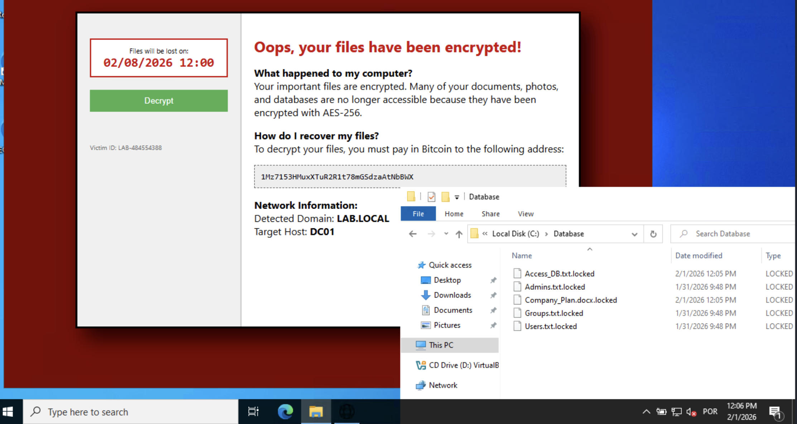


## Project Overview

This project documents a comprehensive cyberattack simulation against a Windows based network infrastructure. The objective was to execute and analyze a complete attack chain from initial unprivileged access through total Domain Controller compromise, culminating in a controlled ransomware deployment scenario.

---

## Infrastructure Components

- **Domain Controller**: Windows Server 2022 (`DC01.lab.local`)
- **Endpoints**: Windows 11 (`APINTO-PC`, `PMARTINS-PC`)
- **Core Services**: Active Directory, MSSQL Server, SMB

---

## 🔍 1. Reconnaissance & Internal Mapping

The initial phase focused on data collection and mapping the Active Directory environment. I utilized a Python-based ingestor to extract domain objects, followed by BloodHound to analyze the ingested data and identify critical misconfigurations within the trust hierarchy.

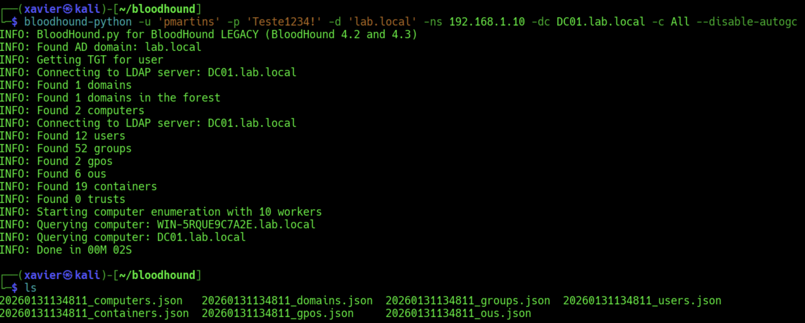 Figure 1: Executing the data ingestor to enumerate domain users, groups, and GPOs.

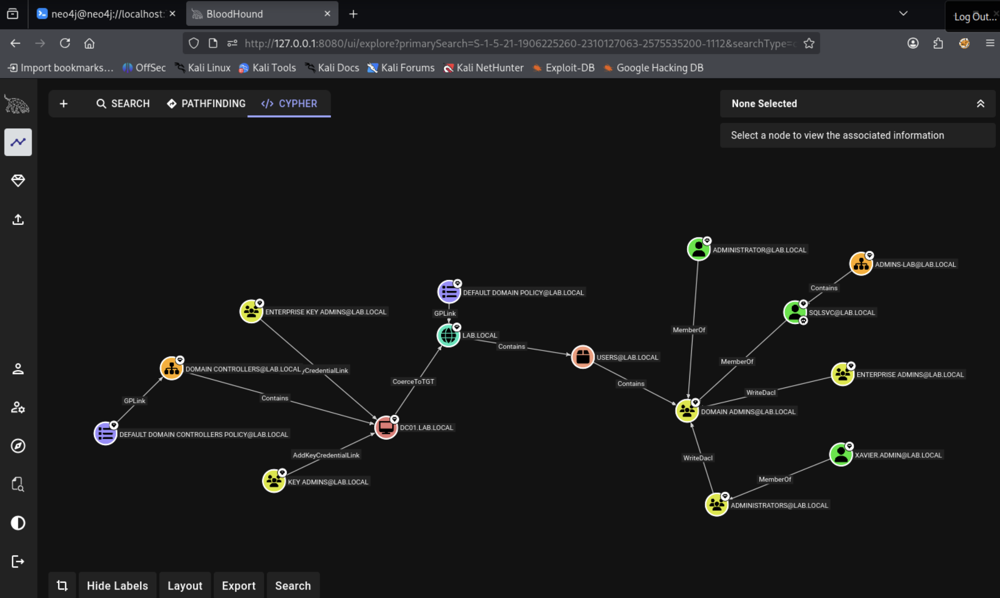 Figure 2: Analyzing attack paths via BloodHound to identify the shortest route to Domain Admin.


**Observation**: Even in a minimal lab environment, the interconnectedness of accounts and permissions creates exploitable paths. Production environments with larger user bases would present significantly more attack vectors.

---

## 🔑 2. Credential Exploitation & Lateral Movement

This phase demonstrated exploitation of Kerberos protocol vulnerabilities to escalate privileges and bypass standard authentication mechanisms.

### Kerberoasting Attack

Targeted the `sqlsvc` Service Principal Name (SPN) using **GetUserSPNs.py** to extract TGS tickets. Kerberoasting is particularly effective because ticket extraction is a legitimate Kerberos operation that typically doesn't trigger security alerts.

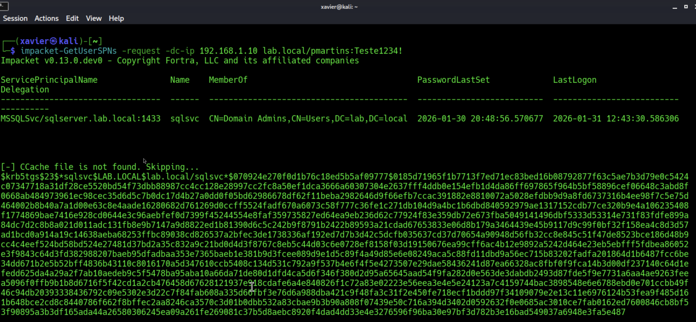 
*Figure 3: TGS ticket extraction using Impacket's GetUserSPNs tool.*

### Offline Password Cracking

The extracted ticket was subjected to offline cracking using **John the Ripper**. The service account password (`Teste1234!`) was recovered within minutes. Since the credential was not present in the default wordlists, I utilized a custom mutation strategy. By combining base dictionary terms with common patterns observed in the local region and culture, I successfully identified the password. This highlights that even "custom" passwords follow predictable patterns that can be bypassed with targeted wordlist manipulation.

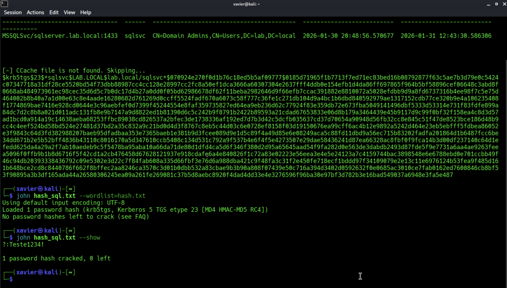  
*Figure 4: sqlsvc password successfully cracked. Weak service account credentials remain a critical vulnerability.*

### Domain Database Extraction

With administrative credentials obtained, **secretsdump.py** was used to extract the NTDS.dit database, yielding all domain password hashes including `xavier.admin` and the built-in `Administrator` account.

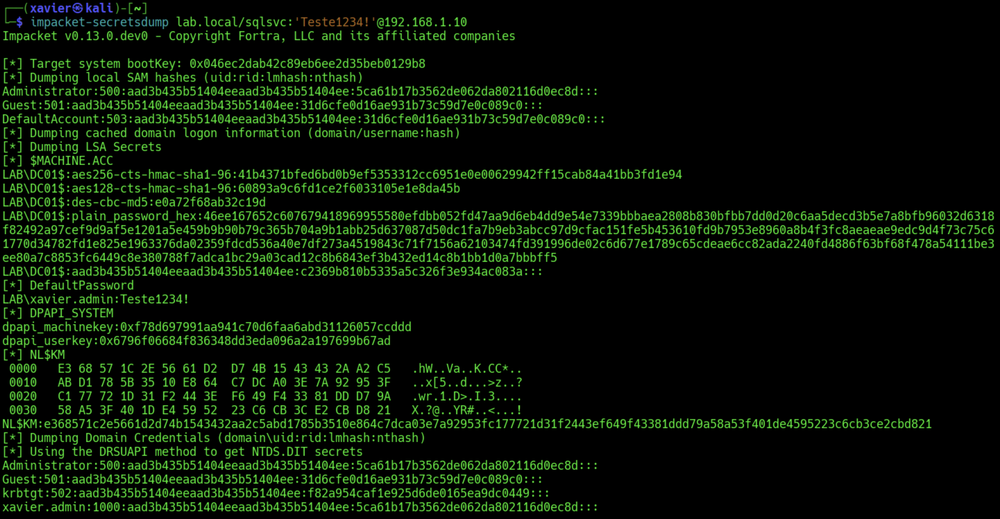  
*Figure 5: Full domain compromise confirmed via NTDS.dit extraction.*

**Technical Note**: Achieving Domain Admin privileges represents complete organizational compromise. At this stage, all systems, data, and credentials become accessible to the attacker.

---

## 🔥 3. Targeted Impact (Ransomware Execution)

For the impact phase, a custom encryption stager was developed and deployed across the domain infrastructure. While a Domain Admin has the privileges to disable security controls via Group Policy Objects (GPOs), for the efficiency of this simulation and to focus on the encryption logic, real-time protection was manually adjusted.

In a real-world scenario, this phase would involve:

GPO Manipulation: Using administrative rights to push a policy that disables Windows Defender across the domain.

Exclusion Injection: Adding the malware's working directory to the exclusion list via PowerShell (Add-MpPreference -ExclusionPath).

By bypassing these controls, the simulation focuses on the behavioral impact of the ransomware rather than the signature-based detection, which is often trivial once Domain Admin access is achieved.

### Design Considerations

To maintain infrastructure operability for post-compromise analysis, the encryption targeted specific high value directories (`C:\Database`) rather than entire system drives. This approach simulates surgical ransomware attacks while preserving the infrastructure environment for continued research.

This methodology also reflects real world scenarios where threat actors maintain partial system functionality to facilitate data exfiltration or maximize ransom leverage.

### Evasion Techniques

The primary defensive control encountered was **Windows Defender** real-time protection. Evasion was achieved by leveraging Domain Admin privileges to configure folder exclusions, simulating a realistic post-exploitation scenario where attackers manipulate security policies after gaining administrative access.

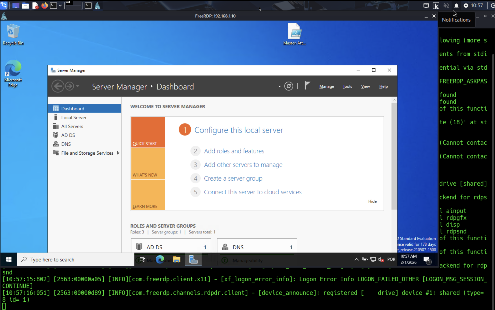  
*Figure 6: Remote administrative session established via xfreerdp.*

Note: Administrative manual intervention was used to streamline the simulation. In a production environment, a Domain Admin would achieve the same result via GPO-enforced deactivation of security providers.

### Payload Analysis

The encryption phase was executed via a custom PowerShell-based stager. The logic was designed to be lightweight and fast, focusing on high-value data directories to maximize operational impact while avoiding system instability.

```powershell
# Custom Encryption Engine
$TargetDirectory = "C:\Database"
$Key = "SimplifiedEncryptionKey123" # In a real scenario, this would be asymmetric

Get-ChildItem -Path $TargetDirectory -Recurse -File -Exclude "*.locked", "READ_ME.txt" | ForEach-Object {
    $file = $_.FullName
    # Simulation of file header manipulation and extension change
    Rename-Item -Path $file -NewName ($file + ".locked")
}

# Generate and deploy the Ransom Note
$RansomNotePath = Join-Path $TargetDirectory "READ_ME.html"
$HTMLContent = "<html><body><h1>GAME OVER: Your Files are Encrypted</h1><p>Contact your admin.</p></body></html>"
$HTMLContent | Out-File -FilePath $RansomNotePath
```

### Execution & Impact

Simultaneous ransomware deployment across all three systems:

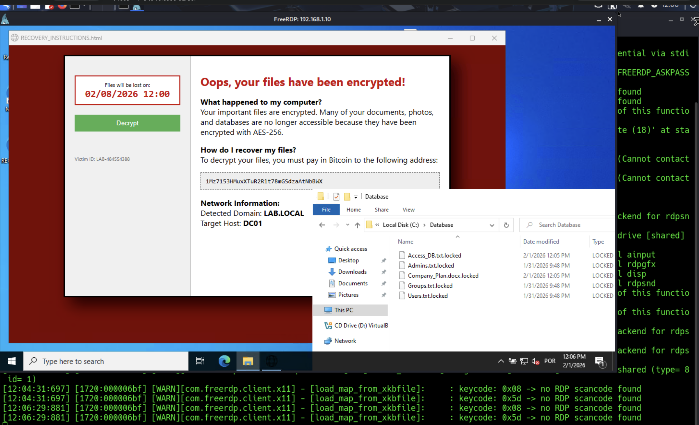  

---

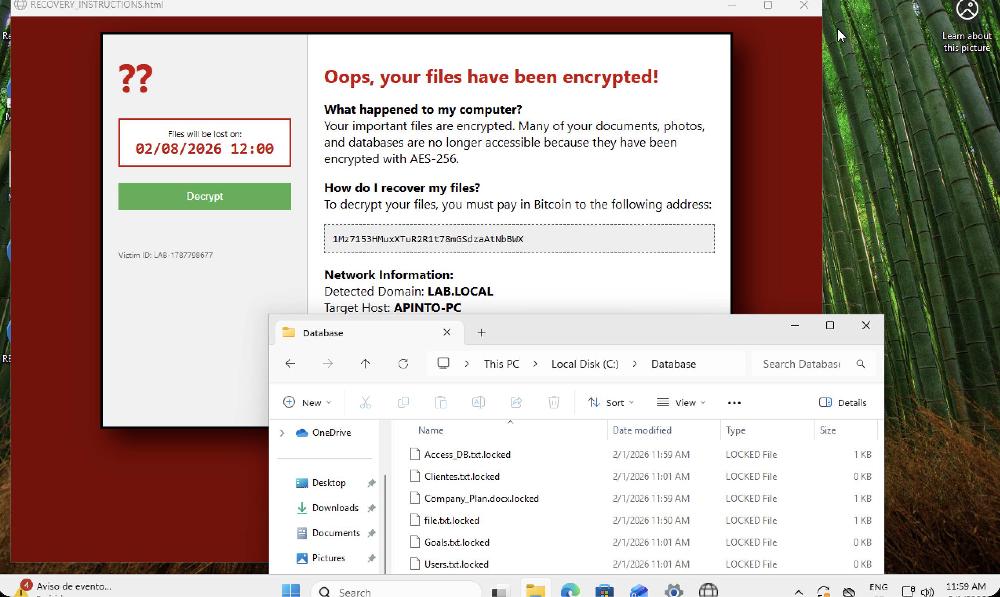  

---

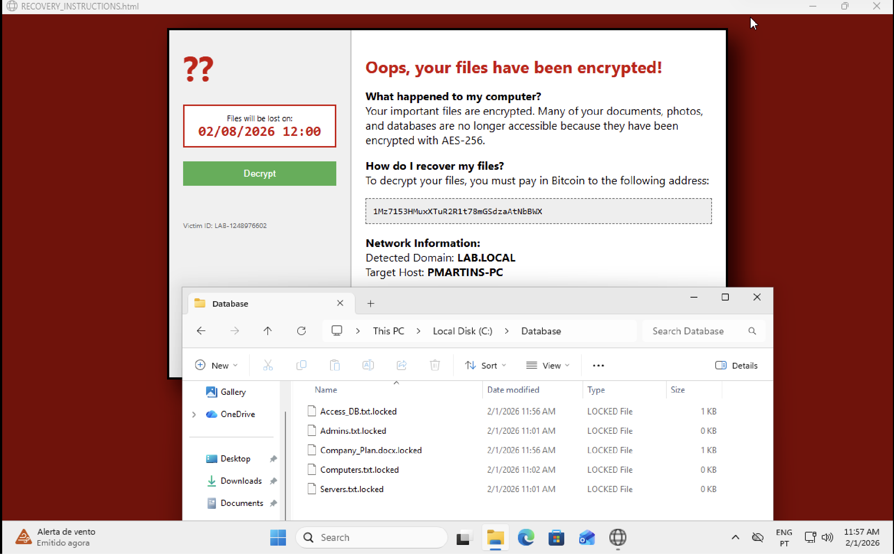  
*Figures 8-10: Domain-wide encryption achieved. All target files renamed to `.locked` with ransom notifications deployed.*

---

## 🛠️ 4. Remediation & Data Integrity Verification

Following impact demonstration, the recovery protocol was executed to ensure complete data reversibility and validate the encryption mechanism's integrity.
```powershell
# Recovery Protocol
# Reverts the .locked extension to restore original file access

$TargetDirectory = "C:\Database"

Get-ChildItem -Path $TargetDirectory -Recurse -Filter "*.locked" | ForEach-Object {
    $OriginalName = $_.FullName.Replace(".locked", "")
    try {
        Rename-Item -Path $_.FullName -NewName $OriginalName -ErrorAction Stop
        Write-Host "[+] Successfully restored: $OriginalName" -ForegroundColor Green
    }
    catch {
        Write-Host "[-] Failed to restore: $($_.Name)" -ForegroundColor Yellow
    }
}

# Cleanup: Removing the ransom notification
Remove-Item -Path (Join-Path $TargetDirectory "READ_ME.html") -Force
```
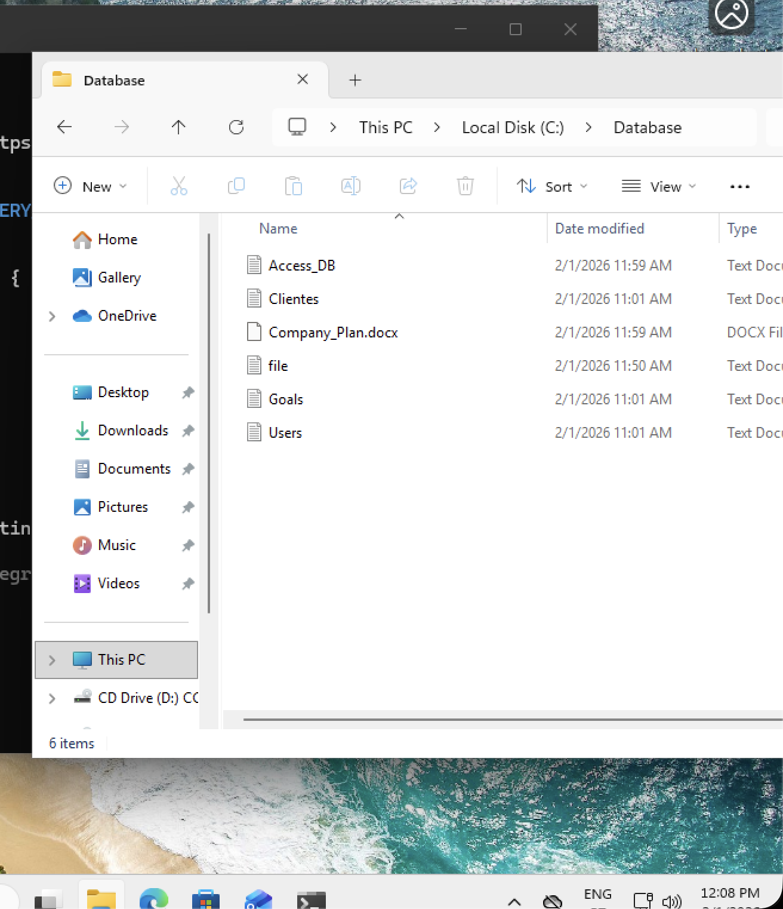

This verification step confirmed the simulation remained controlled and that all encryption operations were technically safe and fully reversible.

---

## Technical Conclusions

### 1. Service Account Security

The `sqlsvc` account with a weak password (`Teste1234!`) served as the primary attack vector. Service accounts frequently receive elevated privileges during initial configuration and subsequently remain unmanaged, creating persistent security weaknesses.

**Mitigation**: Implement minimum 30-character randomly generated passwords for service accounts. Where possible, utilize Managed Service Accounts (MSAs) or Group Managed Service Accounts (gMSAs).

### 2. Domain Admin Compromise Impact

This simulation confirmed that Domain Admin compromise represents absolute organizational failure. Once achieved, all subsequent actions including ransomware deployment, data exfiltration, and persistence become trivial exercises.

Access to NTDS.dit provides attackers with every password hash in the domain, enabling unlimited lateral movement and long term persistence.

### 3. Defensive Mitigations & Detection Strategies

The success of the attack chain relied on service account misconfigurations and lateral movement. To mitigate these risks, the following security controls are recommended:

A. Identity & Protocol Hardening

Service Account Security: Implementation of Group Managed Service Accounts (gMSAs) to enforce long, complex, and automatically rotated passwords. This renders Kerberoasting attempts mathematically infeasible due to the entropy of the passwords.

SMB Signing: Enforcing digital signatures on all SMB (Server Message Block) communications. This prevents NTLM Relay attacks by ensuring the integrity of the communication channel.

Tiered Administrative Model: Restricting Domain Admin logins exclusively to Domain Controllers. By preventing high-privileged sessions on workstations, the risk of credential or token theft during lateral movement is neutralized.

B. Detection & Deception

Honeytokens: Deployment of "decoy" accounts (e.g., backup_admin) with no legitimate business function. Any Kerberoasting attempt or login activity targeting these accounts serves as a high-fidelity "silent alarm" for early intruder detection.

Log Analysis (Event ID 4769): Continuous monitoring of Kerberos Service Ticket requests. Tracking spikes in Event ID 4769 from a single host is a primary indicator of a Kerberoasting attack in progress.

C. Endpoint Protection & Anti-Ransomware

ASR Rules (Attack Surface Reduction): Implementation of Microsoft Defender ASR rules to block unauthorized scripts from performing bulk file renaming or encryption.

Tamper Protection: Ensuring that security agents cannot be disabled or bypassed through folder exclusions, which was a critical step in the final stage of this simulation.

### 4. Attack Path Complexity

BloodHound analysis revealed clear, exploitable paths from low-privilege accounts to Domain Admin even in this minimal three-machine environment. Enterprise environments with thousands of users and complex trust relationships would present exponentially more attack vectors.

**Mitigation**: Conduct regular BloodHound assessments to identify and eliminate unnecessary privilege relationships. Implement least-privilege principles across all accounts and groups.

---

## Lessons Learned

This project reinforced several key security principles:

- **Prevention depth matters**: Multiple security layers increase attacker time and resource investment, potentially deterring opportunistic attacks
- **Credential hygiene is fundamental**: Weak service account passwords remain one of the most common and exploitable vulnerabilities
- **Privilege escalation is rapid**: Once initial access is obtained, progression to Domain Admin can occur within minutes given common misconfigurations
- **Defense requires visibility**: Without proper logging and monitoring, these attack techniques can execute undetected

The simulation demonstrated that security effectiveness isn't measured by preventing every attack attempt, but by increasing the difficulty and cost of successful compromise to the point where attackers seek easier targets.

---

## Future Work

Planned extensions of this research:

- Implement comprehensive logging and SIEM integration to detect these techniques in real-time
- Develop automated response playbooks for Kerberoasting and credential dumping detection
- Deploy deception technologies (honeytokens, honeypots) to enable earlier attack detection
- Harden the environment according to industry best practices and re-attempt the attack chain to measure defensive improvement
- Document detection signatures and defensive strategies for each attack phase

---

**Disclaimer**: This project was conducted in an isolated lab environment for educational purposes only. All techniques described should only be performed against systems you own or have explicit written permission to test.
